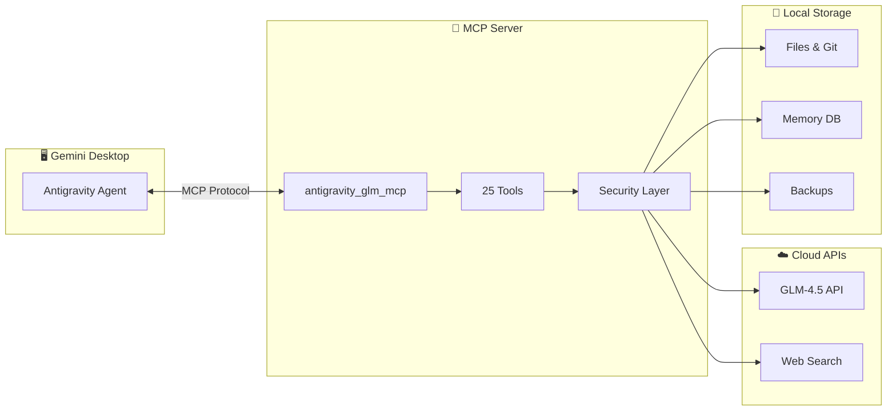
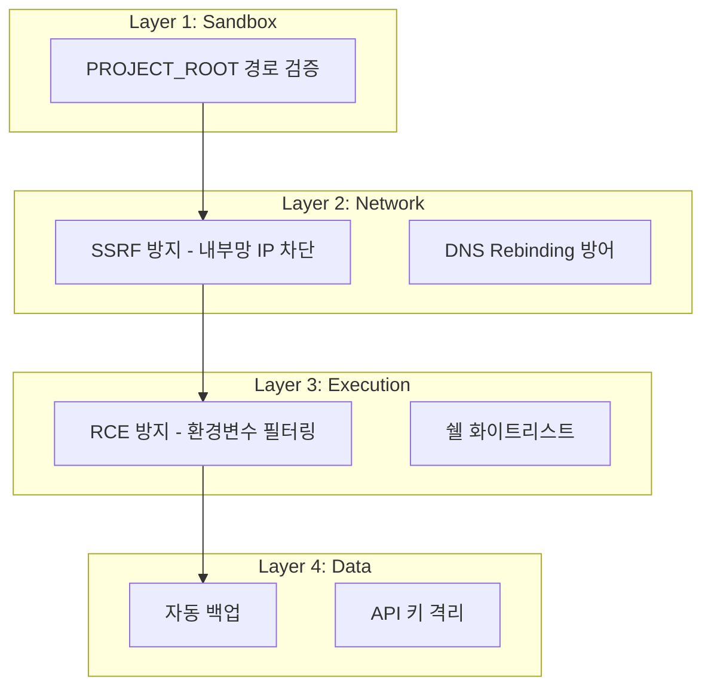

<div align="center">

# 🚀 Antigravity GLM MCP

**Gemini (Antigravity) ⟷ GLM-4.5 모델 브릿지 MCP 서버**

*복잡한 코딩 작업을 GLM AI에게 위임하고, 25가지 강력한 도구로 자동화하세요.*

[](https://www.python.org/)
[](https://modelcontextprotocol.io/)
[]()
[](LICENSE)
[]()

[📖 문서](#-문서) · [⚡ 빠른 시작](#-빠른-시작-5분) · [🛠️ 도구](#️-전체-도구-목록-25개) · [🛡️ 보안](#️-보안-아키텍처)

</div>

---

## ✨ 왜 이 프로젝트인가요?

| 문제점 | 해결책 |
|--------|--------|
| 🐳 복잡한 Docker 설정 | ✅ **Zero-Docker**: HTTPS 직접 호출로 즉시 시작 |
| 🔐 API 키 유출 우려 | ✅ **보안 강화**: 환경변수 필터링, 샌드박스 적용 |
| 📁 파일 실수 복구 불가 | ✅ **자동 백업**: 수정/삭제 전 버전 관리 |
| 🧠 세션 간 정보 손실 | ✅ **영구 메모리**: JSON 기반 장기 기억 저장소 |
| ⚠️ 위험한 쉘 명령 실행 | ✅ **화이트리스트**: 승인된 명령만 허용 |

---

## 🏗️ 아키텍처



---

## 📖 문서

| 📄 문서 | 🔍 설명 |
|:--------|:--------|
| **[🏛️ 아키텍처](docs/ARCHITECTURE.md)** | 시스템 설계, 보안 계층, 통신 흐름 상세 |
| **[📚 도구 레퍼런스](docs/TOOLS.md)** | 25개 도구 파라미터 및 응답 명세 |
| **[⚡ 퀵스타트](docs/QUICKSTART.md)** | 5분 설치 가이드 및 첫 사용 예제 |

---

## ⚡ 빠른 시작 (5분)

### 📋 사전 요구사항

- **Python 3.11+** (가상환경 권장)
- **[Zhipu AI API 키](https://open.bigmodel.cn/)** 또는 호환 엔드포인트

### 🚀 설치 방법

```bash
# 1. 저장소 클론
git clone https://github.com/coreline-ai/antigravity_glm_mcp.git
cd antigravity_glm_mcp

# 2. 가상환경 생성 및 활성화
python3.11 -m venv .venv
source .venv/bin/activate  # Windows: .venv\Scripts\activate

# 3. 자동 설치 (권장)
python scripts/install.py
```

<details>
<summary><b>📝 수동 설치 (대안)</b></summary>

```bash
# 의존성 설치
pip install -r requirements.txt

# MCP 설정 파일에 추가 (~/.gemini/settings.json 등)
```

```json
{
  "mcpServers": {
    "antigravity_glm_mcp": {
      "command": "/path/to/.venv/bin/python",
      "args": ["/path/to/antigravity_glm_mcp/src/server.py"],
      "env": {
        "PROJECT_ROOT": "/your/workspace",
        "ZHIPU_API_KEY": "your-api-key",
        "GLM_MODEL": "GLM-4.5",
        "GLM_BASE_URL": "https://api.z.ai/api/coding/paas/v4",
        "PYTHONPATH": "/path/to/antigravity_glm_mcp"
      }
    }
  }
}
```

</details>

---

## 🛠️ 전체 도구 목록 (25개)

### 🧠 지능 위임 (Intelligence Delegation)

| 도구 | 설명 | 주요 파라미터 |
|:-----|:-----|:-------------|
| **`glm_cmd`** | GLM에 복잡한 작업 위임 | `task_description`, `context` |
| **`glm_bypass`** | 원시 프롬프트 직접 전송 | `prompt` |
| **`glm_image_analyze`** | 이미지 분석 (Vision) | `image_path`, `prompt` |

### 📁 파일 시스템 (File System)

| 도구 | 설명 | 주요 파라미터 |
|:-----|:-----|:-------------|
| **`glm_file_read`** | 파일 내용 읽기 | `path`, `encoding` |
| **`glm_file_create`** | 새 파일 생성 | `path`, `content`, `overwrite` |
| **`glm_file_edit`** | 문자열 치환 수정 | `path`, `old_string`, `new_string` |
| **`glm_file_delete`** | 파일 삭제 (백업 보관) | `path` |
| **`glm_file_rollback`** | 이전 버전 복원 | `path`, `version` |
| **`glm_dir_list`** | 디렉토리 목록 | `path`, `recursive` |
| **`glm_grep`** | 정규식 파일 검색 | `pattern`, `path`, `case_sensitive` |

### 💻 코드 실행 (Code Execution)

| 도구 | 설명 | 주요 파라미터 |
|:-----|:-----|:-------------|
| **`glm_code_run`** | Python 샌드박스 실행 | `code`, `timeout` |
| **`glm_shell_exec`** | 화이트리스트 쉘 실행 | `command`, `cwd` |

### 🌿 Git 협업 (Git Collaboration)

| 도구 | 설명 | 주요 파라미터 |
|:-----|:-----|:-------------|
| **`glm_git_status`** | 저장소 상태 조회 | `repo_path` |
| **`glm_git_commit`** | 변경사항 커밋 | `message`, `add_all` |
| **`glm_git_log`** | 커밋 이력 조회 | `n`, `oneline` |
| **`glm_git_diff`** | 변경사항 비교 | `stat_only`, `commit` |

### 🌐 네트워크 (Network)

| 도구 | 설명 | 주요 파라미터 |
|:-----|:-----|:-------------|
| **`glm_http_request`** | HTTP 요청 (SSRF 방지) | `url`, `method`, `body` |
| **`glm_web_search`** | DuckDuckGo 웹 검색 | `query`, `max_results` |

### 🧠 메모리 & 데이터 (Memory & Data)

| 도구 | 설명 | 주요 파라미터 |
|:-----|:-----|:-------------|
| **`glm_memory_save`** | 장기 메모리 저장 | `key`, `value`, `category` |
| **`glm_memory_get`** | 메모리 조회 | `key` |
| **`glm_memory_list`** | 전체 메모리 목록 | `category`, `limit` |
| **`glm_memory_delete`** | 메모리 삭제 | `key` |
| **`glm_db_query`** | SQLite 쿼리 실행 | `query`, `db_path`, `read_only` |

### 📊 관리 & 로깅 (Management)

| 도구 | 설명 | 주요 파라미터 |
|:-----|:-----|:-------------|
| **`glm_schedule_task`** | 작업 예약 (Cron) | `action`, `cron`, `command` |
| **`glm_action_log`** | 에이전트 활동 로그 | `limit`, `action_filter` |

---

## 🛡️ 보안 아키텍처

이 프로젝트는 **4단계 보안 계층**을 구현합니다:



| 보호 대상 | 위협 | 방어 조치 |
|:----------|:-----|:----------|
| 파일 시스템 | Path Traversal | `PROJECT_ROOT` 외부 접근 차단 |
| 네트워크 | SSRF 공격 | 내부망 IP(10.x, 172.x, 192.168.x) 필터링 |
| 코드 실행 | RCE / 키 유출 | `ZHIPU_API_KEY` 등 민감 환경변수 차단 |
| 쉘 명령 | 시스템 파괴 | `rm -rf`, `sudo` 등 위험 명령 차단 |

> [!WARNING]
> `glm_shell_exec`는 **화이트리스트에 등록된 안전한 명령만** 실행합니다.
> `rm`, `sudo`, `chmod 777` 등은 원천 차단됩니다.

---

## 🔧 환경변수 설정

| 변수명 | 필수 | 설명 | 기본값 |
|:-------|:----:|:-----|:-------|
| `ZHIPU_API_KEY` | ✅ | GLM API 인증 키 | - |
| `PROJECT_ROOT` | ✅ | 작업 대상 디렉토리 | 현재 디렉토리 |
| `GLM_MODEL` | ❌ | 사용할 모델 | `glm-4-plus` |
| `GLM_BASE_URL` | ❌ | API 엔드포인트 | `https://open.bigmodel.cn/api/paas/v4` |
| `GLM_TIMEOUT` | ❌ | 요청 타임아웃 (초) | `120` |

---

## 📂 프로젝트 구조

```
antigravity_glm_mcp/
├── 📄 README.md                 # 이 문서
├── 📄 requirements.txt          # Python 의존성
├── 📄 pyproject.toml            # 패키지 메타데이터
│
├── 📁 src/                      # 소스 코드
│   ├── server.py                # MCP 서버 진입점
│   ├── models.py                # 공통 모델 (ToolResponse 등)
│   │
│   ├── 📁 core/                 # 핵심 인프라
│   │   ├── config.py            # 설정 관리자
│   │   ├── glm_client.py        # GLM API 클라이언트
│   │   ├── sandbox.py           # 경로 보안 검증
│   │   └── backup.py            # 자동 백업 시스템
│   │
│   └── 📁 tools/                # 25개 도구 구현
│       ├── glm_cmd.py           # 지능 위임 (cmd, bypass)
│       ├── file_ops.py          # 파일 CRUD
│       ├── dir_ops.py           # 디렉토리 작업
│       ├── grep_ops.py          # 파일 검색
│       ├── code_ops.py          # 코드 실행
│       ├── shell_ops.py         # 쉘 실행
│       ├── git_ops.py           # Git 협업
│       ├── http_ops.py          # HTTP 요청
│       ├── web_ops.py           # 웹 검색
│       ├── db_ops.py            # DB 쿼리
│       ├── memory_ops.py        # 메모리 관리
│       ├── image_ops.py         # 이미지 분석
│       ├── schedule_ops.py      # 작업 예약
│       └── reporting.py         # 로그 관리
│
├── 📁 scripts/                  # 유틸리티 스크립트
│   └── install.py               # 자동 설치 스크립트
│
├── 📁 docs/                     # 문서
│   ├── ARCHITECTURE.md          # 아키텍처 상세
│   ├── TOOLS.md                 # 도구 레퍼런스
│   └── QUICKSTART.md            # 빠른 시작 가이드
│
├── 📁 tests/                    # 테스트 코드
│   ├── local_tools_test.py      # 로컬 도구 통합 테스트
│   └── simple_test.py           # 지능 도구 테스트
│
└── 📁 data/                     # 런타임 데이터 (Git 제외)
    ├── memory/                  # 영구 메모리 저장소
    └── action_logs.jsonl        # 에이전트 활동 로그
```

---

## 🧪 테스트

```bash
# 가상환경 활성화 후

# 1. .env 파일 생성 (권장)
cp .env.sample .env
# .env 파일을 열어 ZHIPU_API_KEY를 입력하세요.

# 2. 로컬 도구 테스트 (API 키 불필요)
./.venv/bin/python tests/local_tools_test.py

# 3. 지능 도구 테스트 (API 키 필요)
# .env 파일이 없다면 직접 export 하세요.
export ZHIPU_API_KEY="your-key" 
./.venv/bin/python tests/simple_test.py
```

---

## 📜 라이선스

이 프로젝트는 **MIT License** 하에 배포됩니다. 
자유롭게 사용, 수정, 배포하실 수 있습니다.

---

<div align="center">

**Made with ❤️ for Gemini × GLM Collaboration**

[](https://github.com/coreline-ai/antigravity_glm_mcp)

</div>
