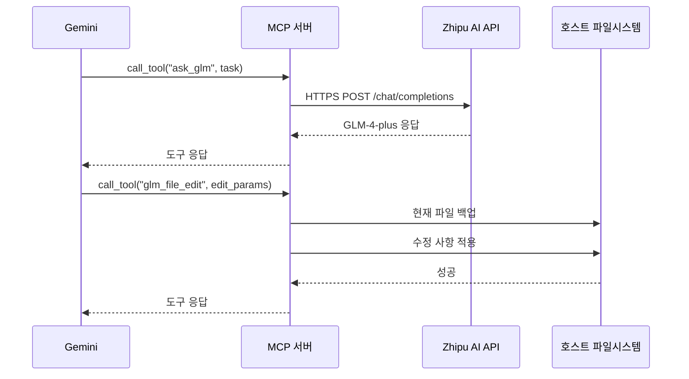

# 아키텍처: Gemini GLM Agent MCP

이 문서는 `gemini-glm-agent-mcp` 프로젝트의 아키텍처를 설명합니다. 이 프로젝트는 Gemini(Antigravity)가 GLM-4-plus와 협업할 수 있도록 합니다.

## 개요

이 시스템은 Gemini와 GLM-4-plus 모델 사이의 브릿지 역할을 하는 MCP 서버로 구성됩니다. **Docker 컨테이너 없이** GLM API를 직접 호출하여 빠르고 간단하게 동작합니다.

## 구성 요소

1.  **Gemini (Antigravity)**: 이 MCP 서버를 사용하여 작업을 위임하는 주요 LLM입니다.
2.  **MCP 서버 (`gemini-glm-agent-mcp`)**: Model Context Protocol을 구현합니다. Gemini의 도구 요청을 처리합니다.
3.  **GLM API (Zhipu AI)**: HTTPS를 통해 직접 호출되는 GLM-4-plus 백엔드입니다.
4.  **호스트 파일시스템**: 샌드박스와 자동 백업 시스템으로 보호되는 파일 작업 대상입니다.

## 통신 흐름

## 보안 설계

- **샌드박스**: 모든 파일 작업은 `PROJECT_ROOT` 디렉토리로 제한됩니다.
- **백업**: 파일의 수정 또는 삭제 시 `.glm_backups/`에 자동 백업이 생성됩니다.
- **API 키 보안**: `ZHIPU_API_KEY`는 환경변수로만 전달되며 코드에 저장되지 않습니다.
- **무상태 MCP**: MCP 서버 자체는 무상태이며, 파일시스템에만 상태를 저장합니다.

## 환경변수

| 변수명 | 필수 | 설명 |
|--------|------|------|
| `ZHIPU_API_KEY` | ✅ | Zhipu AI API 키 |
| `PROJECT_ROOT` | ✅ | 작업 대상 프로젝트 폴더 경로 |
| `GLM_MODEL` | ❌ | 사용할 모델 (기본: `glm-4-plus`) |
| `GLM_TIMEOUT` | ❌ | API 타임아웃 초 (기본: 120) |
