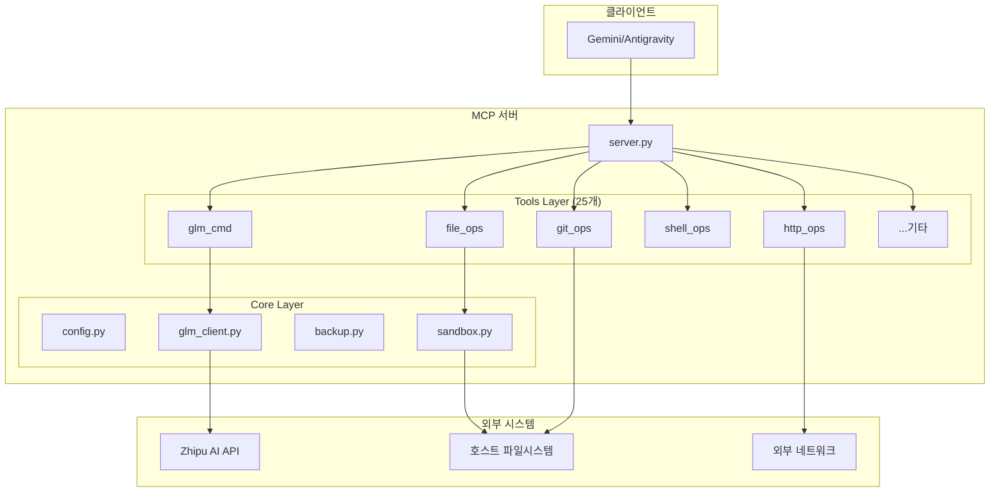
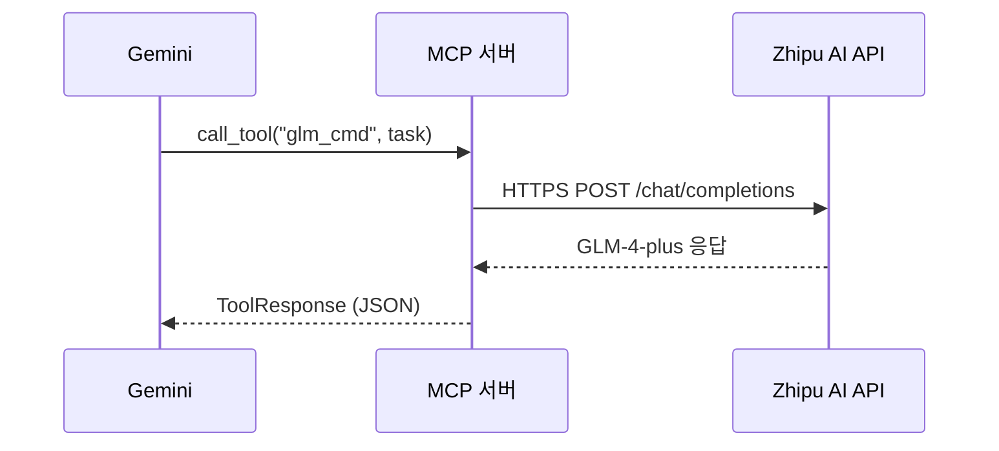
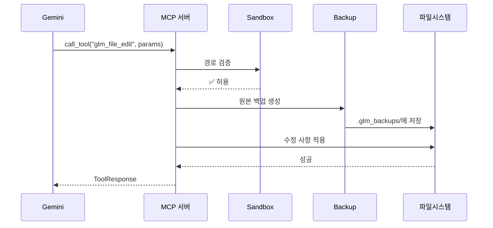

# 아키텍처: Antigravity GLM MCP

> 이 문서는 `antigravity_glm_mcp` 프로젝트의 시스템 아키텍처를 설명합니다.

---

## 📐 개요

이 시스템은 **Gemini(Antigravity)**와 **GLM-4-plus** 모델 사이의 브릿지 역할을 하는 MCP 서버입니다.

**핵심 특징**:
- 🚀 **Docker 불필요**: GLM API를 직접 호출
- 🔒 **다층 보안**: 샌드박스, SSRF 방지, RCE 차단
- 📦 **25개 도구**: 파일, Git, 코드, 네트워크, 메모리 관리

---

## 🏗️ 시스템 구성 요소



---

## 📊 통신 흐름

### GLM 위임 요청


### 파일 수정 요청


---

## 🔐 보안 설계

### 다층 보안 아키텍처

| 계층 | 보호 대상 | 구현 |
|------|----------|------|
| **샌드박스** | 파일시스템 | `PROJECT_ROOT` 외부 접근 차단 |
| **SSRF 방지** | 네트워크 | DNS Rebinding 방지, 내부망 IP 차단 |
| **RCE 방지** | 코드 실행 | 환경변수 필터링, API 키 유출 차단 |
| **쉘 제한** | 시스템 명령 | 화이트리스트 기반 명령어 제한 |

### 샌드박스 동작
```python
# sandbox.py 핵심 로직
def validate_path(self, path: str) -> bool:
    resolved = Path(path).resolve()
    return resolved.is_relative_to(self.project_root)
```

### SSRF 방지 핵심
```python
# http_ops.py 핵심 로직
# 1. DNS 해석
addr_info = socket.getaddrinfo(host, port)

# 2. 모든 IP 검증
for ip in resolved_ips:
    if ip.is_private or ip.is_loopback:
        return BLOCKED  # 내부망 차단

# 3. 검증된 IP로 직접 요청 (DNS Rebinding 방지)
target_url = url._replace(netloc=verified_ip)
```

---

## 📁 디렉토리 구조

```
antigravity_glm_mcp/
├── src/
│   ├── server.py           # MCP 서버 진입점
│   ├── models.py           # 공통 모델 (ToolResponse, ErrorCode)
│   ├── core/
│   │   ├── config.py       # 설정 관리
│   │   ├── glm_client.py   # GLM API 클라이언트
│   │   ├── sandbox.py      # 경로 보안 검증
│   │   └── backup.py       # 자동 백업 관리
│   └── tools/              # 25개 도구 모듈
│       ├── glm_cmd.py      # GLM 위임
│       ├── file_ops.py     # 파일 CRUD
│       ├── dir_ops.py      # 디렉토리 조회
│       ├── grep_ops.py     # 파일 검색
│       ├── code_ops.py     # Python 실행
│       ├── shell_ops.py    # 쉘 실행 (화이트리스트)
│       ├── git_ops.py      # Git 작업
│       ├── http_ops.py     # HTTP 요청 (SSRF 방지)
│       ├── web_ops.py      # 웹 검색
│       ├── db_ops.py       # SQLite 쿼리
│       ├── memory_ops.py   # 메모리 관리
│       ├── image_ops.py    # 이미지 분석
│       ├── schedule_ops.py # 작업 예약
│       └── reporting.py    # 로그 관리
├── scripts/
│   └── install.py          # 설치 스크립트
├── data/                   # 런타임 데이터
│   ├── memory.json         # 메모리 저장소
│   └── action_logs.jsonl   # 작업 로그
└── docs/                   # 문서
```

---

## 🔧 환경변수

| 변수명 | 필수 | 설명 | 기본값 |
|--------|------|------|--------|
| `ZHIPU_API_KEY` | ✅ | Zhipu AI API 키 | - |
| `PROJECT_ROOT` | ✅ | 작업 대상 프로젝트 경로 | - |
| `GLM_MODEL` | ❌ | 사용할 모델 | `glm-4-plus` |
| `GLM_TIMEOUT` | ❌ | API 타임아웃 (초) | `120` |
| `PYTHONPATH` | ✅ | 모듈 import 경로 | MCP 서버 루트 |

---

## 📈 성능 고려사항

- **비동기 처리**: 모든 도구가 `async/await` 기반
- **타임아웃**: 각 도구별 적절한 타임아웃 설정
  - GLM API: 120초
  - 쉘 명령: 60초 (최대 300초)
  - HTTP 요청: 30초
  - 코드 실행: 10초
- **결과 제한**: `glm_grep` 등 대용량 조회 도구는 `max_results` 파라미터 제공
