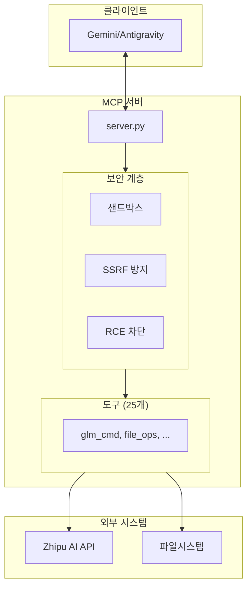

# Antigravity GLM MCP - Product Requirements Document (PRD)

**버전**: 1.0.0  
**작성일**: 2026-02-01  
**상태**: Released ✅

---

## 1. 제품 개요

### 1.1 제품명
**Antigravity GLM MCP** (Model Context Protocol Server)

### 1.2 한 줄 요약
> Gemini(Antigravity) 에이전트와 GLM-4.5 AI 모델을 연결하는 보안 강화 MCP 브릿지 서버

### 1.3 핵심 가치 제안

| 문제점 | 솔루션 |
|--------|--------|
| 복잡한 Docker 기반 AI 통합 | **Zero-Docker** HTTPS 직접 호출 방식 |
| AI 코드 실행 보안 위험 | **4단계 보안 계층** (샌드박스, SSRF/RCE 방지) |
| 파일 실수 복구 불가 | **자동 백업** 및 버전 관리 |
| 세션 간 컨텍스트 손실 | **영구 메모리** 시스템 |

---

## 2. 목표 사용자

### 2.1 주요 페르소나

| 페르소나 | 설명 | 주요 니즈 |
|----------|------|-----------|
| **AI 개발자** | Gemini 에이전트로 코딩 작업 자동화 | 안전한 코드 실행, 파일 관리 |
| **DevOps 엔지니어** | Git 워크플로우 자동화 | 쉘 명령 실행, 버전 관리 |
| **데이터 분석가** | AI 기반 데이터 처리 | DB 쿼리, 웹 검색 |

### 2.2 사용 시나리오

1. **코드 리팩토링 자동화**: "이 레거시 코드를 최신 패턴으로 GLM에게 리팩토링 시켜줘"
2. **프로젝트 분석**: "프로젝트 구조를 분석하고 개선점을 찾아줘"
3. **문서 자동 생성**: "이 API의 문서를 자동으로 작성해줘"

---

## 3. 기능 요구사항

### 3.1 핵심 도구 (25개)

#### 🧠 지능 위임 (3개)
| 도구 | 우선순위 | 상태 |
|------|----------|------|
| `glm_cmd` - 복잡한 작업 위임 | P0 | ✅ 완료 |
| `glm_bypass` - Raw 프롬프트 전송 | P0 | ✅ 완료 |
| `glm_image_analyze` - 이미지 분석 | P1 | ✅ 완료 |

#### 📁 파일 관리 (7개)
| 도구 | 우선순위 | 상태 |
|------|----------|------|
| `glm_file_read/create/edit/delete` | P0 | ✅ 완료 |
| `glm_file_rollback` - 버전 복원 | P1 | ✅ 완료 |
| `glm_dir_list` - 디렉토리 조회 | P0 | ✅ 완료 |
| `glm_grep` - 파일 검색 | P1 | ✅ 완료 |

#### 💻 코드/쉘 실행 (2개)
| 도구 | 우선순위 | 상태 |
|------|----------|------|
| `glm_code_run` - Python 샌드박스 | P0 | ✅ 완료 |
| `glm_shell_exec` - 화이트리스트 쉘 | P1 | ✅ 완료 |

#### 🌿 Git 협업 (4개)
| 도구 | 우선순위 | 상태 |
|------|----------|------|
| `glm_git_status/commit/log/diff` | P0 | ✅ 완료 |

#### 🌐 네트워크 (2개)
| 도구 | 우선순위 | 상태 |
|------|----------|------|
| `glm_http_request` - SSRF 방지 HTTP | P1 | ✅ 완료 |
| `glm_web_search` - 웹 검색 | P1 | ✅ 완료 |

#### 💾 메모리/데이터 (4개 + 1개)
| 도구 | 우선순위 | 상태 |
|------|----------|------|
| `glm_memory_save/get/list/delete` | P1 | ✅ 완료 |
| `glm_db_query` - SQLite 쿼리 | P2 | ✅ 완료 |

#### 📊 관리 (2개)
| 도구 | 우선순위 | 상태 |
|------|----------|------|
| `glm_schedule_task` - 작업 예약 | P2 | ✅ 완료 |
| `glm_action_log` - 활동 로그 | P2 | ✅ 완료 |

---

## 4. 비기능 요구사항

### 4.1 보안 요구사항

| 요구사항 ID | 설명 | 구현 상태 |
|-------------|------|-----------|
| SEC-001 | 파일 접근은 `PROJECT_ROOT` 내로 제한 | ✅ |
| SEC-002 | SSRF 공격 방지 (내부망 IP 차단) | ✅ |
| SEC-003 | DNS Rebinding 방어 | ✅ |
| SEC-004 | RCE 방지 (환경변수 필터링) | ✅ |
| SEC-005 | 위험 쉘 명령 차단 (화이트리스트) | ✅ |
| SEC-006 | API 키 유출 방지 | ✅ |

### 4.2 성능 요구사항

| 요구사항 ID | 메트릭 | 목표값 |
|-------------|--------|--------|
| PERF-001 | GLM API 응답 시간 | < 120초 |
| PERF-002 | 파일 작업 응답 시간 | < 1초 |
| PERF-003 | 동시 처리 | 비동기 (async/await) |

### 4.3 호환성 요구사항

| 요구사항 ID | 설명 | 상태 |
|-------------|------|------|
| COMPAT-001 | Python 3.11+ 지원 | ✅ |
| COMPAT-002 | macOS/Linux 지원 | ✅ |
| COMPAT-003 | Gemini (Antigravity) 클라이언트 연동 | ✅ |

---

## 5. 시스템 아키텍처

---

## 6. 릴리스 계획

### v1.0.0 (현재) ✅
- [x] 25개 핵심 도구 구현
- [x] 4단계 보안 계층 적용
- [x] 자동 백업 시스템
- [x] 영구 메모리 기능
- [x] 문서화 완료 (README, ARCHITECTURE, TOOLS, QUICKSTART)
- [x] MIT 라이선스 및 보안 정책 문서

### v1.1.0 (계획)
- [ ] 멀티 프로젝트 동시 지원
- [ ] 스트리밍 응답 지원
- [ ] 더 많은 GLM 모델 지원 (GLM-4V 등)

### v2.0.0 (로드맵)
- [ ] 웹 기반 대시보드
- [ ] 플러그인 시스템
- [ ] 팀 협업 기능

---

## 7. 성공 지표 (KPI)

| 지표 | 목표 | 측정 방법 |
|------|------|-----------|
| 도구 정상 작동률 | 100% | 자동화 테스트 |
| 보안 취약점 | 0건 | 정기 감사 |
| 응답 시간 | < 2초 (파일 작업) | 로그 분석 |
| 사용자 만족도 | > 4.5/5 | 피드백 수집 |

---

## 8. 부록

### 8.1 관련 문서
- [🏛️ 아키텍처](docs/ARCHITECTURE.md)
- [📚 도구 레퍼런스](docs/TOOLS.md)
- [⚡ 빠른 시작](docs/QUICKSTART.md)
- [🔒 보안 정책](SECURITY.md)

### 8.2 용어 정의
| 용어 | 정의 |
|------|------|
| **MCP** | Model Context Protocol, AI 모델과 외부 도구를 연결하는 표준 프로토콜 |
| **GLM** | General Language Model, Zhipu AI의 대규모 언어 모델 |
| **SSRF** | Server-Side Request Forgery, 서버 측 요청 위조 공격 |
| **RCE** | Remote Code Execution, 원격 코드 실행 취약점 |

---

**© 2026 Coreline AI - MIT License**

